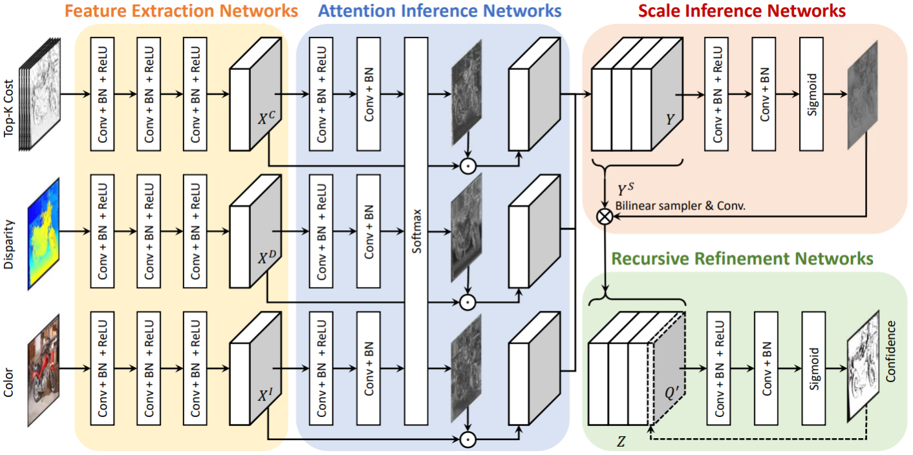

# LAF-Net: Locally Adaptive Fusion Networks for Stereo Confidence Estimation
Official PyTorch code of "LAF-Net: Locally Adaptive Fusion Networks for Stereo Confidence Estimation," 
Sunok Kim, [Seungryong Kim](https://seungryong.github.io/), [Dongbo Min](http://cvl.ewha.ac.kr/), [Kwanghoon Sohn](http://diml.yonsei.ac.kr/), CVPR 2019 (Oral) [[Project Page](https://seungryong.github.io/LAFNet/)].

<p align="center">
  </img>
</p>

## Requirements ##
* `Python 3.8` 
* `PyTorch 1.4`

## Getting started ##
Download KITTI data, containing color images, initial disparity maps, and cost volumes 
of first 20 images in KITTI 2012 benchmark (for training) and 200 images in KITTI 2015 benchmark (for evaluation), at the following link:
* [KITTI-data](https://drive.google.com/file/d/1SDrqZ_iT86HhsE6ycV12nDLbjDrjU1ei/view?usp=sharing)

It contains the data generated with MC-CNN stereo matcher. Please see the paper for details. 

## Evaluation ##
Download the pre-trained model at `saved_models` folder:
* [pretrained-model](https://drive.google.com/file/d/1I2AFVki1YWlY61V75hnf4Y8mQciRU03m/view?usp=sharing)

Launch the following command:
```shell
python evaluate.py
```

It evaluates the LAF-Net on KITTI 2015 benchmark. Please see the paper for details. 

## Training ##
Launch the following command:
```shell
sh train.sh
```
or 
```shell
python train.py
```
Optional arguments:
* `--base_lr` learning rate
* `--batch_size` batch size
* `--num_epochs` maximum epoch
* `--step_size_lr` step size for adjusting learning rate
* `--gamma_lr` gamma for adjusting learning rate

## Citation
  - If you use this code for your research, please cite the following paper. 
```shell
@inproceedings{Kim_CVPR_2019,
  title     = {LAF-Net: Locally Adaptive Fusion Networks For Stereo Confidence Estimation},
  author    = {Kim, Sunok and Kim, Seungryong and Min, Dongbo and Sohn, Kwanghoon},
  booktitle = {IEEE/CVF Conference on Computer Vision and Pattern Recognition (CVPR)},
  year = {2019}
}
```   

## Acknowledgements

Thanks to [Matteo Poggi](https://mattpoggi.github.io/) for sharing KITTI data and AUC code.
