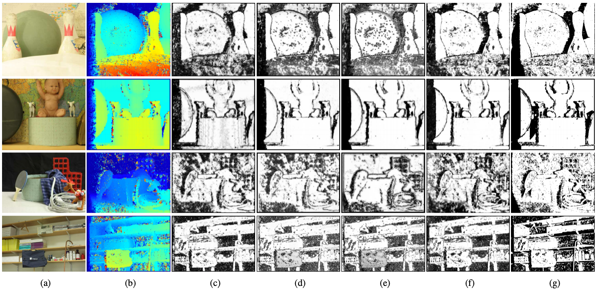

# LAF-Net: Locally Adaptive Fusion Networks for Stereo Confidence Estimation
Official PyTorch code of "LAF-Net: Locally Adaptive Fusion Networks for Stereo Confidence Estimation," 
Sunok Kim, [Seungryong Kim](https://seungryong.github.io/), [Dongbo Min](http://cvl.ewha.ac.kr/), [Kwanghoon Sohn](http://diml.yonsei.ac.kr/), CVPR 2019 [[Project Page](https://seungryong.github.io/LAFNet/)].

</img>

</img> 
